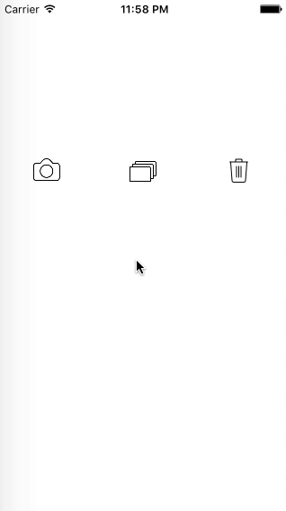
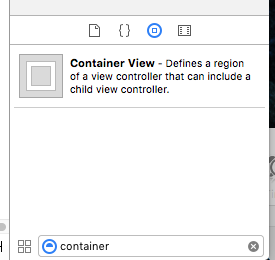
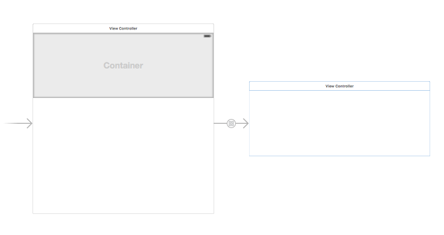
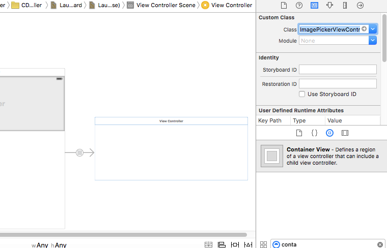
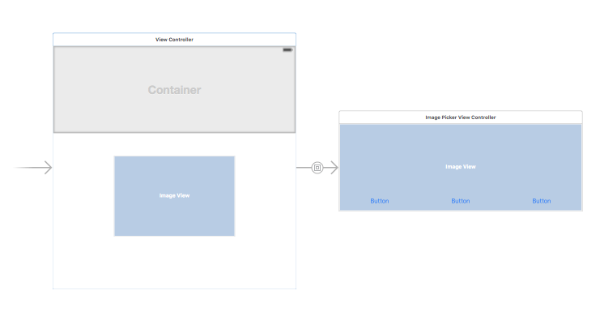
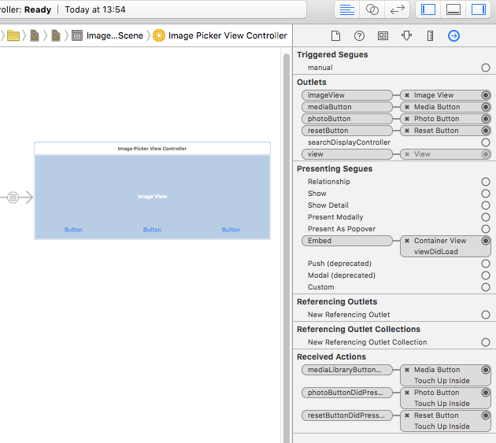

[](https://twitter.com/Codeveyor)

## CDVImagePickerViewController v1.0

`CDVImagePickerViewController` is a fully customizable image picker written in Objective-C. Subclassed from UIViewController

[](http://codeveyor.com)

## Requirements

`CDVImagePickerViewController` uses ARC and requires iOS 7.0+. Works for iPhone and iPad

##Installation

###Cocoapods

###Manual
Drag CDVImagePickerViewController folder to your project 

##How to use
1.Find Container View at the list of available UI elements in Interface Builder

[](http://codeveyor.com)

2.Drag it to view, place and constrain it as you wish.

[](http://codeveyor.com)

You will see that actual container created and connected to view scene with Embed Segue. Give a name for a segue

3.Set container class as `CDVImagePickerViewController` at Identity Inspector tab

[](http://codeveyor.com)

4.Add ImageView and buttons in order you wish and constrain them

[](http://codeveyor.com)

5.Don't forget to set outlets and actions

[](http://codeveyor.com)

6.Subscribe to delegate in your ViewController and define Embed Segue saw before in Storyboard. Use the delegate methods

``` objective-c
@interface ViewController () <CDVImagePickerViewControllerViewControllerDelegate>
@property (nonatomic, strong) CDVImagePickerViewControllerViewController *imagePickerViewController;
@end

static NSString * const kImagePickerSegue = @"toImagePicker";

@implementation ViewController

- (void)prepareForSegue:(UIStoryboardSegue *)segue sender:(id)sender
{
    if ([segue.identifier isEqualToString:kImagePickerSegue])
    {
        // setup of view container
        self.imagePickerViewController = (CDVImagePickerViewControllerViewController *)[segue destinationViewController];
        self.imagePickerViewController.delegate = self;
    }
}

#pragma mark - ImagePicker Delegate

- (void)resetImage
{
    // code for resetting image
}

- (void)imageDidSelected:(UIImage *)image
{
    // code for getting image
}

- (void)imagePickerReturnedError:(NSError *)error
{
    if (error)
    {
        NSLog(@"%@", [error localizedDescription]);
    }
}
```

7.Enjoy!

## To Do

- improve custom interface to capturing from camera
- implement search image functionality
- callback blocks
- improve test coverage
- add pod
- make a Swift version

## Contact

[Alex](https://github.com/alexth)


##License
The MIT License (MIT). See `LICENSE` file for more details
 
